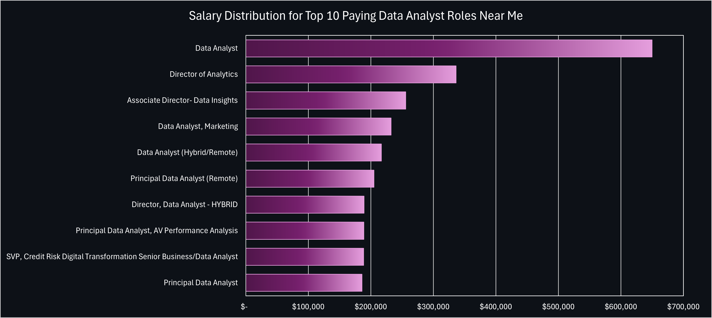
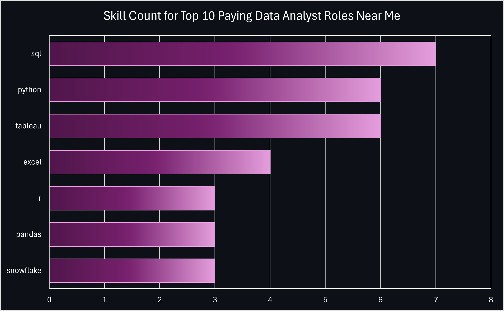

# Background
As a new graduate looking to break into the field of data, I wanted to explore what skills companies in the real world are looking for. Although my time studying at university is done, my learning journey is far from over and I believe maintaining a student's mindset is the key to continuing to grow in any area of life.   

The data utilized for the project came from [Luke Barousse's SQL Course](https://www.lukebarousse.com/sql) and contains detailed information on job postings for data related roles gathered between December 2022 and 2023.

This project served a dual purpose of allowing me to practice my skills in SQL while also uncovering actionable insights that I could leverage to assist my career journey and provide the most value to employers. 

### The questions I wanted to answer for the project were:
1. What are the **top-paying** data analyst jobs near me?
2. What **skills** are **required** for these top-paying jobs?
3. What skills are most **in-demand**?
4. Which skills are associated with **higher salaries**?
5. What are the **most optimal** skills to learn?

# Tools Used
- **SQL** for queries
- **MS Excel** for visualizations 
- **PostgreSQL** as the  DBMS
- **Visual Studio Code** as the IDE 
- **Git & Github**  for version control

# The Analysis
### 1. Top 10 Paying Data Analyst Jobs
To identify the highest-paying roles, I filtered all data analyst positions by average yearly salary and location, focusing on jobs in the Tampa, FL area or remote positions. 
```sql
SELECT	
	job_title,
    name AS company_name,
	job_location,
	salary_year_avg
FROM job_postings_fact
LEFT JOIN company_dim ON job_postings_fact.company_id = company_dim.company_id
WHERE
    job_title_short = 'Data Analyst' AND 
    (job_location = 'Tampa, FL' OR
    job_location = 'Anywhere') AND
    salary_year_avg IS NOT NULL
ORDER BY salary_year_avg DESC
LIMIT 10;
```
 
*Bar graph showcasing the salaries of the top 10 data analyst roles in 2023 from Tampa, FL or remote positions.*
   
Insights from query results
- **Location Flexibility** - The query results suggest a growing trend towards remote work opportunities as 9 out of the 10 jobs returned were listed as being located 'Anywhere'.
- **Industry Variation** - The roles being offered come from diverse companies that span various industries such as tech (Meta), finance (Citi), and telecommunications (AT&T)

### 2. Top 10 Paying Skills
I built upon the first query, joining the *skills* data table to it in order to get a clearer understanding of what employers typically desire for higher-paying roles.
```sql
WITH top10_paying_jobs AS (
    SELECT	
        job_id,
        job_title,
        name AS company_name,
        job_location,
        salary_year_avg
    FROM job_postings_fact
    LEFT JOIN company_dim ON job_postings_fact.company_id = company_dim.company_id
    WHERE
        job_title_short = 'Data Analyst' AND 
        (job_location = 'Tampa, FL' OR
        job_location = 'Anywhere') AND
        salary_year_avg IS NOT NULL
    ORDER BY salary_year_avg DESC
    LIMIT 10
)

SELECT 
    top10_paying_jobs.job_id,
    top10_paying_jobs.job_title,
    top10_paying_jobs.salary_year_avg,
    skills,
    COUNT(skills_dim.skills) OVER (PARTITION BY skills_dim.skills) AS skill_count
FROM top10_paying_jobs
INNER JOIN skills_job_dim ON top10_paying_jobs.job_id = skills_job_dim.job_id
INNER JOIN skills_dim ON skills_job_dim.skill_id = skills_dim.skill_id
ORDER BY skill_count DESC;
```
 
*Bar graph depicting the skills that appear more than three times within the job results from the first query*

Insights from query results:
- **SQL** is the most demanded skill for top-paying data-related roles, appearing 7 times in the top 10 highest paying jobs
- **Python** and **Tableau** are tied for second place, appearing 6 times
- While **Excel**, **R**, **Pandas**, and **Snowflake** are not as high in demand, they are still valuable skills to learn as these results may vary when more jobs are taken into account. 


### 3. In-Demand Data Analysis Skills
Next, I wanted to consider how the results of the last query would stack up against the entire dataset of data analyst job postings.
```sql
SELECT 
    skills,
    COUNT(skills_job_dim.job_id) AS demand_count
FROM job_postings_fact
INNER JOIN skills_job_dim ON job_postings_fact.job_id = skills_job_dim.job_id
INNER JOIN skills_dim ON skills_job_dim.skill_id = skills_dim.skill_id
WHERE
    job_title_short = 'Data Analyst' AND
    (job_location = 'Tampa, FL' OR
    job_location = 'Anywhere')
GROUP BY skills
ORDER BY demand_count DESC
LIMIT 5;
``` 
| Skills  | Demand Count |
|---------|--------------|
| SQL     | 7954         |
| Excel   | 5140         |
| Python  | 4692         |
| Tableau | 4080         |
| Power BI| 2845         |   

*Table showcasing demand for the top 5 skills in data analyst job postings*  
      
Insights from query results:   
- These results are more in line with what I would expect for data analyst roles
- Most roles prioritize data manipulation and analysis over visualization as evidenced by **SQL** and **Excel** being the top 2 demanded skills.
- While absent from the results of the previous query which only looked at the top 10 highest paying data analyst roles, **Tableau** and **Power BI** are the 4th and 5th most demanded skills overall  

### 4. Top Skills by Salary
Similarly to how the 2nd query explored the skills for the top 10 highest paying jobs, this one compares the average salaries of each skill to discover which ones are the highest paying.
```sql
SELECT 
    skills,
    ROUND(AVG(salary_year_avg), 0) AS avg_salary
FROM job_postings_fact
INNER JOIN skills_job_dim ON job_postings_fact.job_id = skills_job_dim.job_id
INNER JOIN skills_dim ON skills_job_dim.skill_id = skills_dim.skill_id
WHERE
    job_title_short = 'Data Analyst' AND
    (job_location = 'Tampa, FL' OR
    job_location = 'Anywhere') AND
    salary_year_avg IS NOT NULL
GROUP BY skills
ORDER BY avg_salary DESC
LIMIT 10;
```
| Skills        | Avg Salary ($) |
|---------------|----------------|
| PySpark       | 208,172        |
| Bitbucket     | 189,155        |
| Couchbase     | 160,515        |
| Watson        | 160,515        |
| DataRobot     | 155,486        |
| GitLab        | 154,500        |
| Swift         | 153,750        |
| Jupyter       | 152,777        |
| Elasticsearch | 145,000        |
| Golang        | 145,000        |

*Table showcasing the top 10 skills by average salary*   

Insights from query results:
- **High-Demand Data Technologies**:  Skills in **PySpark**, **Bitbucket**, and **Couchbase** command the highest average salaries, indicating strong market demand for expertise in **big data processing**, **version control**, and **NoSQL database management**.
- **Importance of Diverse Technical Proficiencies**: High average salaries associated with technologies like **Watson** and **DataRobot** underscores the value of skills in **AI** and **machine learning** for landing lucrative positions.

### 5. Most Optimal Skills to Learn
In order to determine what skills would be the most optimal to learn, I queried the skills that appear in at least 10 job postings and sorted them by average salary and demand.
```sql
SELECT 
    skills_dim.skill_id,
    skills_dim.skills,
    COUNT(skills_job_dim.job_id) AS demand_count,
    ROUND(AVG(job_postings_fact.salary_year_avg), 0) AS avg_salary
FROM job_postings_fact
INNER JOIN skills_job_dim ON job_postings_fact.job_id = skills_job_dim.job_id
INNER JOIN skills_dim ON skills_job_dim.skill_id = skills_dim.skill_id
WHERE
    job_title_short = 'Data Analyst' AND
    (job_location = 'Tampa, FL' OR
    job_location = 'Anywhere') AND
    salary_year_avg IS NOT NULL
GROUP BY skills_dim.skill_id
HAVING COUNT(skills_job_dim.job_id) > 10
ORDER BY
    avg_salary DESC,
    demand_count DESC
LIMIT 10;
```
| Skills       | Demand Count | Avg Salary ($) |
|--------------|--------------|----------------|
| Pandas       | 11           | 142,399        |
| Databricks   | 13           | 133,774        |
| Confluence   | 11           | 114,210        |
| Hadoop       | 27           | 113,847        |
| Snowflake    | 40           | 112,943        |
| Go           | 30           | 112,577        |
| Azure        | 38           | 109,780        |
| BigQuery     | 13           | 109,654        |
| AWS          | 32           | 108,317        |
| Java         | 21           | 105,591        |

*Table showcasing the top 10 skills by Average Salary and Demand*

Insights from query results:   
- **Data Manipulation and Big Data Tools** - **Pandas** and **Databricks** are among the top-paying skills, highlighting their significant value in data manipulation and big data analytics. As data complexity increases, expertise in these tools is expected to remain highly sought after and well-compensated
- **Strong Demand for Cloud Technologies** - The high average salaries associated with skills such as **AWS** and **Azure** suggest that skills in cloud computing will continue to be highly valued as organizations shift more towards cloud-based solutions.  

# What I Learned
As a result of this project, I've been able to refine my SQL knowledge through 
- **Creation of Complex Queries** - Utilizing CTEs to define subsets of data filtering results that are custom tailored to meet my criteria
- **Data Aggregation** - Further filtering and aggregating data using GROUP BY and PARTITION BY clauses in combination with COUNT() and AVG() functions
- **Joins** - Combining 2 to 3 tables within queries to provide more comprehensive results

# Conclusions
### Insights
My query results generated several insights:   
1. **Top-Paying Jobs Near Me**: Salaries for high level roles range from around $200k to $700k and span a range of industries including technology, finance, and telecommunications. There’s also a noticeable shift towards remote work in most high-paying positions. 
2. **Skills Required by Top-Paying Jobs**: **SQL** is the most sought-after skill for high-paying data roles, followed by **Python** and **Tableau**. 
3. **Most In-Demand Skills**: The emphasis is on data manipulation skills such as **SQL** and **Excel**, with visualization tools like **Tableau** and **Power BI** also in demand, albeit slightly less.
4. **Skills With Highest Average Salaries**: High salaries are associated with skills in **PySpark**, **Bitbucket**, and **Couchbase**, which are crucial for big data, version control, and NoSQL databases. 
5. **Providing the Most Value with Optimal Skills**: **Pandas** and **Databricks** top the list and are key for data manipulation and analytics, while expertise in **AWS** and **Azure** is increasingly valuable as organizations continue to move towards cloud solutions.

### Closing Thoughts
This project was a great exercise in using real world data to determine the most impactful data analysis skills to learn in order to offer the most value to employers. It helped me establish a clearer career roadmap for both the short and long term and enhanced my ability to formulate and answer investigative questions—skills essential for any analyst, regardless of the stage of their career.


